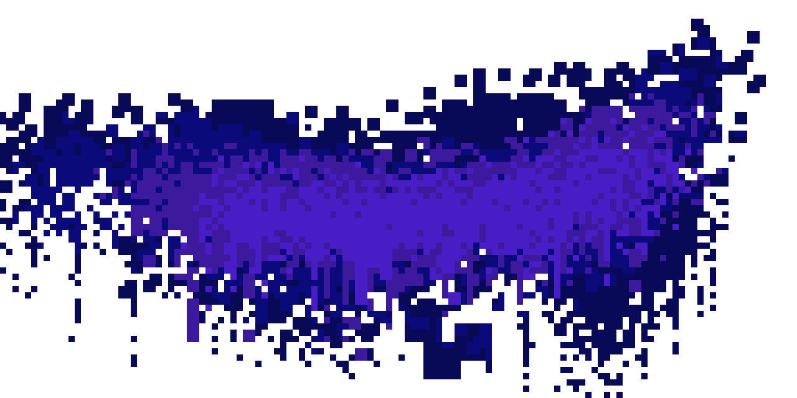

# ☄️ TheUCP

  

``Indie Game Developer | Computer Science student | Artist | Composer``

An aspiring indie developer who likes to craft things, from games all the way to utility software. I like to create to make other people's lives at least just a bit better. Whether you're looking for entertainment to wind down and have fun, or you're a fellow developer like myself, you can count on me to keep creating for you!

---

## Languages and Tools

  
  
  
  
  
  
  
  
  

  

  

